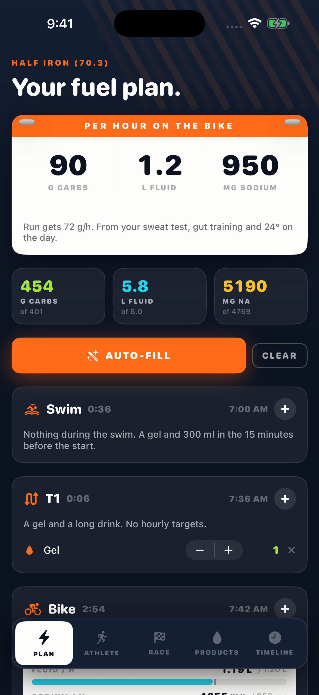
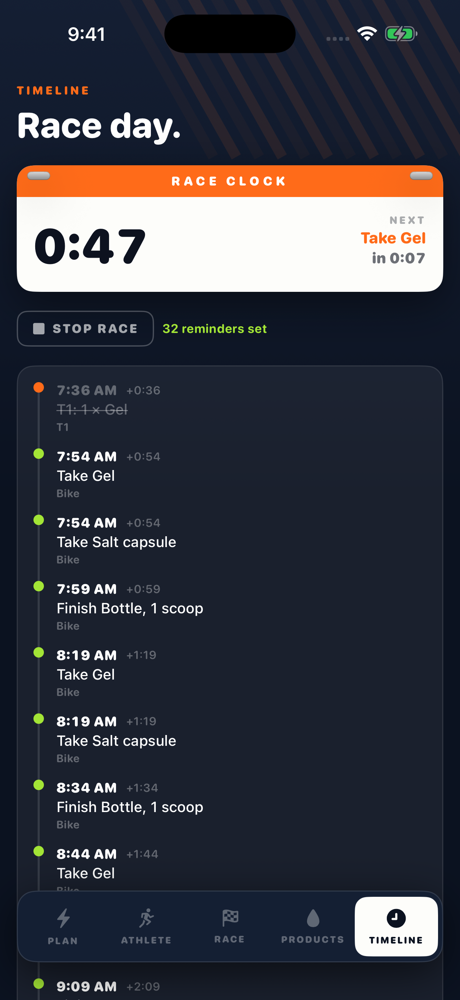
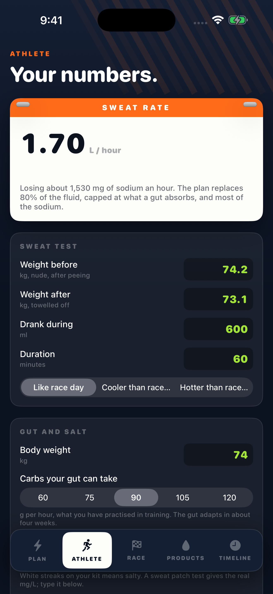

# Race Fuel

Builds a race-day nutrition plan (carbs, fluid, sodium by the hour) from your own numbers, then reminds you to take every gel.

  

**Coming to the App Store.**

<p align="center">
  
  
  
</p>

Race-day nutrition fails in the details: the right grams at the right time, from products you have actually trained with. Race Fuel does the arithmetic and carries the plan to the start line.

## Features

- Athlete: sweat rate from a weigh-in test corrected for race-day heat, sodium loss per hour, carb targets from gut training
- Race presets from sprint triathlon to full iron distance, marathon, half, century, gran fondo and 50 km trail, or your own legs
- Per-leg carb, fluid and sodium targets, with fluid capped at what a gut absorbs
- Your own products: gels, chews, mixed bottles, salt capsules, bars, cola, aid-station cups
- Auto-fill to the targets, then adjust counts per leg with live gauges; caffeine budget and shopping list
- Race day: a timeline by clock time, and a race clock that fires a local notification for each intake

## Price

A paid app: one price, no in-app purchases, no subscription, no ads.

## Privacy

No network code at all: Race Fuel makes no requests and collects no data. Reminders are local notifications. Everything is saved on the device in `racefuel.json`. A planning tool, not medical advice. The privacy manifest (`Resources/PrivacyInfo.xcprivacy`) declares no tracking and no collected data types.

## Built without a Mac

This app was written on a Windows PC. No Mac is involved at any point: every build, signature, screenshot and App Store submission runs on GitHub Actions macOS runners, driven by the App Store Connect API.

- **`project.yml`** is an [XcodeGen](https://github.com/yonaskolb/XcodeGen) spec. The `.xcodeproj` is generated on the runner and never committed, so the repo can be edited on any OS and there are no `.pbxproj` merge conflicts.
- **`.github/workflows/build.yml`** runs on every push: picks the newest Xcode 26 and iPhone simulator on the runner, builds, then launches the app once per screen with `-shot <screen>` (sample data, fixed 9:41 status bar) and captures the store screenshots with `simctl`, uploaded as a workflow artifact.
- **`.github/workflows/appstore.yml`** (manual) has three modes: `compile`, `dry_run` (build, sign, upload, do not submit) and `release` (also submits for review). The distribution certificate is imported from a secret into a throwaway keychain; [fastlane](https://fastlane.tools) (`fastlane/Fastfile`) fetches the App Store profile with the API key, sets the build number one above the latest on TestFlight, archives, and uploads the binary with `fastlane/metadata` and the committed `fastlane/screenshots`.
- **`.github/workflows/review-video.yml`** records the App Review screen recording: the app is launched with `-demoAutoplay` and drives its own real screens.
- **`Store/*.py`** talk to the App Store Connect API directly from Windows (Python, `requests` + `PyJWT`): `asc.py` registers the bundle id and pushes metadata, `listing.py` sets the age rating, review details, price and screenshots, and `signing.py` creates the distribution certificate locally so its private key is never stranded on a disposable runner.

Only one step is manual: Apple's API will not create the app record itself, so that is made once in the App Store Connect web UI.

## Build and run

With a Mac and Xcode 26 (the version CI uses; the app targets iOS 17+):

```bash
brew install xcodegen
xcodegen generate
open RaceFuel.xcodeproj
```

Run the `RaceFuel` scheme on any iPhone simulator. No signing is needed for the simulator; from the command line:

```bash
xcodebuild build -project RaceFuel.xcodeproj -scheme RaceFuel \
  -destination 'platform=iOS Simulator,name=iPhone 16 Pro' CODE_SIGNING_ALLOWED=NO
```

To see it filled with sample data, launch with a screenshot argument, e.g. `xcrun simctl launch booted com.mattbusel.racefuel -shot plan`.

Without a Mac: fork the repo and push. The Build workflow compiles it on a GitHub macOS runner and attaches the screenshots as an artifact.

Shipping your own build needs these repository secrets: `ASC_KEY_ID`, `ASC_ISSUER_ID`, `ASC_KEY_CONTENT` (base64 of the `.p8`), `DEVELOPMENT_TEAM`, `DIST_CERT_P12`, `DIST_CERT_PASSWORD`, plus your own bundle id in `project.yml` and `fastlane/Fastfile`.

## Code map

All app code is in `Sources/` (SwiftUI, Observation, no third-party dependencies).

| File | What it does |
| --- | --- |
| `App.swift` | entry point, tabs, `-shot` handling |
| `Model.swift` | sweat, sodium and carb maths, race presets, the auto-fill planner |
| `Views.swift` | plan, athlete, race, products, timeline and race-day screens |
| `Theme.swift` | race-bib look |
| `Autopilot.swift` | drives the real screens for the App Review recording |

`Store/` holds the App Store Connect scripts, `fastlane/` the lanes, listing text and screenshots, `Resources/` the asset catalog and privacy manifest.

---

**More apps built the same way:** [Chain](https://github.com/Mattbusel/chain), [Ironbook](https://github.com/Mattbusel/ironbook), [Quiver](https://github.com/Mattbusel/quiver), [Minder](https://github.com/Mattbusel/minder), [Baseline Ledger](https://github.com/Mattbusel/baseline-ledger), [Fairway Ledger](https://github.com/Mattbusel/fairway-ledger), [Odometer](https://github.com/Mattbusel/odometer), [Rooms](https://github.com/Mattbusel/rooms), [Clockout](https://github.com/Mattbusel/clockout), [Curve](https://github.com/Mattbusel/curve), [Pricebook](https://github.com/Mattbusel/pricebook), [Chores](https://github.com/Mattbusel/chores), [Pawprint](https://github.com/Mattbusel/pawprint), [Pocket Beings](https://github.com/Mattbusel/pocket-beings), [Glyphstorm](https://github.com/Mattbusel/glyphstorm), [Clear the Strait](https://github.com/Mattbusel/clear-the-strait).
